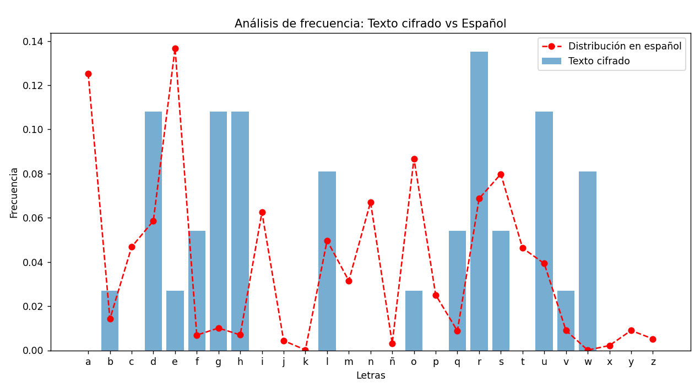

# Laboratorio No. 1 – Encriptado y Decriptado de Texto

## Funciónes de encriptado y decriptado

### Cifrado Caesar
```
Texto original: Laboratorio de encriptado y desencriptado
Mensaje cifrado: oderudwrulr gh hqfulswdgr b ghvhqfulswdgr
```

### Cifrado Afín
```
Texto original: Laboratorio de encriptado y desencriptado
Mensaje cifrado: linapizapwa xc cvspwfzixa y xcucvspwfzixa
```

### Cifrado Vigenére
```
Texto original: Laboratorio de encriptado y desencriptado
Mensaje cifrado: nrjdkovfzxh fv tgqtzxitrq g wsuvvrkwrkish
```

## Análisis de frecuencia
```
Mensaje cifrado: oderudwrulr gh hqfulswdgr b ghvhqfulswdgr
```

### Frecuencia de caracteres en el texto cifrado:
| Letra | Frecuencia | Letra | Frecuencia | Letra | Frecuencia |
|--------|------------|--------|------------|--------|------------|
| r  | 0.14 | f  | 0.05 | b  | 0.03 |
| d  | 0.11 | q  | 0.05 | e  | 0.03 |
| g  | 0.11 | s  | 0.05 | o  | 0.03 |
| h  | 0.11 | w  | 0.08 | v  | 0.03 |
| u  | 0.11 | l  | 0.08 | (resto) | 0.00 |

> **Nota:** Letras no listadas tienen una frecuencia de `0.00`.

## Comparación de distribuciones

### Variación en la Frecuencia de Caracteres:
| Letra | Diferencia | Letra | Diferencia | Letra | Diferencia |
|--------|------------|--------|------------|--------|------------|
| a  | 0.13 | d  | 0.05 | v  | 0.02 |
| e  | 0.11 | f  | 0.05 | b  | 0.01 |
| h  | 0.10 | c  | 0.05 | y  | 0.01 |
| g  | 0.10 | t  | 0.05 | z  | 0.01 |
| w  | 0.08 | q  | 0.05 | j-x-ñ-k | 0.00 |
| u  | 0.07 | m  | 0.03 |  |  |
| n  | 0.07 | l  | 0.03 |  |  |
| r  | 0.07 | s  | 0.03 |  |  |
| i  | 0.06 | p  | 0.03 |  |  |
| o  | 0.06 |  |  |  |  |

> **Nota:** Las letras `j, x, ñ, k` no presentan diferencia (`0.00`).



## Fuerza Bruta

### Cifrado Caesar
```
Mensaje Cifrado:
jjqaopñlhwxañejplzecepwhajyljopwjpaarlhqyeljhwwcehezwzyñemplcñwbeywyñemplwcehezwzmwñwwxñarewñaoqjiaywjeoilzazabajowyñqyewhloxñejzwhwywmwyezwzzailzebeywññwmezwiajpaahqolzawhclñepilouyhwraoyñemplcñwbeyloqjwwyyeljjayaowñewmwñwwjpeyemwñjlowhwobqpqñwowiajwvwozayexañoacqñezwz

Mensaje Descifrado con Fuerza Bruta:
Llave: 23
Texto descifrado: nnuestrolaberintodigitalenconstanteevolucionlaagilidadcriptograficacriptoagilidadparaabreviaresunmecanismodedefensacrucialosbrindalacapacidaddemodificarrapidamenteelusodealgoritmosyclavescriptograficosunaaccionnecesariaparaanticiparnosalasfuturasamenazasdeciberseguridad
```

### Cifrado Afín
```
Mensaje Cifrado:
zigiuñpjdipoziyicbdoddiyxbñhjorbpbdodciñmidiiahxoixdipjcohosmicioxhtpiidmrdipixxjxxiqipjmzoditbpbdodyxmybopsmiñixubhbjopjcohoyozhicpiixpouiujxbodiubpicdicbchiuocfxjtoxbznjxuoybjzqopbjcoociuñxicocsmipjrxoxjzxiymñixoxcixoñbdouizhinmixjzpocsmidiujchxoxjzyxbñhjorbpbdodxiiuñpokozdjxoñbdouizhicmcypoqicyxbñhjrxonbyocfoprjxbhujcyjuñxjuihbdjcñjxjhxjczmiqjcfcirmxjcchibzybdizhicbxqiyjujmzypoxjigiuñpjdipobuñjxhozybodipoyxbñhjorbpbdodizzmichxotohoppoyjzhbzmoyjzhxopocouizokocdbzoubyocdiybtixcirmxbdod

Mensaje Descifrado con Fuerza Bruta:
Llave (a, b): (5, 15)
Texto descifrado:
nejemplodelanecesidaddecriptoagilidadsepuedeextraerdelosataqueseartbleedugdelerrorrevelounadebilidadcrucialquepermitioalosatacantesleerlamemoriademilesdesistemasyrobarinformacionvaliosaasempresasquelograronrecuperarserapidamentefueronlasquedemostraroncriptoagilidadreemplazandorapidamentesusclavescriptograficasyalgoritmoscomprometidosporotrosnuevosysegurossteincidentesirvecomounclaroejemplodelaimportanciadelacriptoagilidadennuestrabatallacontinuacontralasamenazasdinamicasdeciberseguridad
```

### Cifrado Vigenére
```
Mensaje Cifrado: 
pulqnstlcrkdhhcakiqlcevhthyshzkcgofosoqiwafrchsnknynnslaymwbpzyefsahnrañenrezdñlycnoctgcssieqasatnyzsfkeñuwrtarrsktsyrmdsaqnnsitpalrtfcnloialtwhseouwiednelitpcrvwsobetsboqavdftyrdorrgpmdpgglarpdñakosedefrtrlolrxsñofwqlcefzpsñrabriñadsisnlnqxolelrtcpiiiegpaxwppnsujpnriuofqadwzpaatnoaibavzpetivsccgavsaaymwbpzyifaxncnmssejaudbpstsqxolcnoctgcsnpeqtsogugeletcgadatnreudctccfwraqchaesrokscoudwqhyñtdojepsfraqseqotsrafscjseydinblwhknkemdsocnwzgucswgebynvojoqcathabolnieyleorelafvpsrajjtlnsiwharalwcfnreojiaolekebafrtsaixgprjolapsrakrtcnnnbpcnmijjabokoruynmwracsmdiienatxcyufopmcnsñpilmabtnreddidythhridrsresqeydclnswhjaldsgtsycmjplcsishoyleorelavdipyrsjcdcsuwurydhtktsrhsityrsbtnpiwhvowajjtlysudbpstsrerysujpnriuoietefikajmwbjepoeetrynddimcthresbeuwurydhortsadsipnrddjalthhcdjeljcazoeppdctasbpnynbrlyrhgtcnrvojopihrtlyukutnaisrtaatnoaixakbkeqtkdimcthresbeuwurydhepryqnsieynlsvupoleprylsqemñumorinnujpnriuotlcnxdgucpjqpbnrvoaaleusiibavrtcpiiieaeidwsabchblujnwgpbglarpdcsudboqnvzgucpksieltsbknñedwvrncdohowpksieltwowopawhtlkoesctndwrprsnloatncnoctgchscnselihaaraejoerstxa

Mensaje Descifrado con Fuerza Bruta:
Llave: payaso
Texto descifrado:
aunqueelerrorheartbleedsehasolucionadosiemprehayunanuevaamenazaenelhorizontehoylacuanticaesesaamenazaquepuedeatravesartodasnuestrasdefensasantesdequetodoesteperdidodebemosadoptarlacriptoagilidadparadefendernosdisponibleenlasprincipalessolucionesdecriptografiaposcuanticapqcdelaactualidadlaevidenciadelaamenazainminentedelacomputacioncuanticayaestaaquiespecialmentecontecnicascomostorenowdecryptlatersndlqueyaestanenjuegosndlesunmetodoenelqueserobandatoscifradosysealmacenanhastaquelospiratasinformaticospuedandescifrarlosmastardeconunacomputadoracuanticaestosignificaunaamenazainminentelosdatoscifradossegonlosestandaresactualesperoalmacenadosparaundescifradofuturoestaranenriesgoyaquelascomputadorascuanticaseventualmenteromperanlosmetodosdecifradoactualesporlotantosndlesunabombadetiempoyunclarorecordatoriodelaurgenciadeactualizarnuestrosmetodosdecifradoparaqueseansegurosparalacomputacioncuanticaelenfoquepqcabordalanecesidaddecriptoagilidadconvulnerabilidadescomosndlquepresentanunpeligroclaroypresenteahoraeselmomentodedarunsaltocuanticoennuestracriptografia
```
