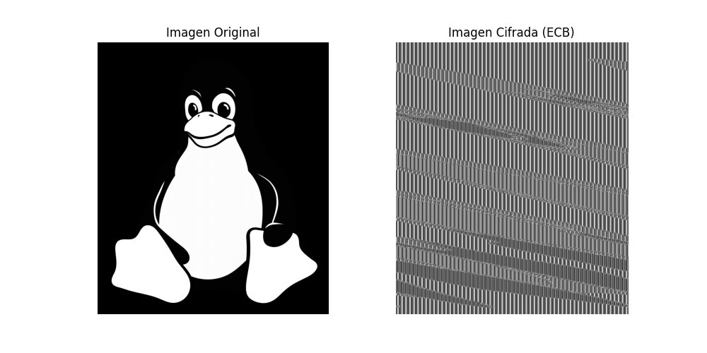
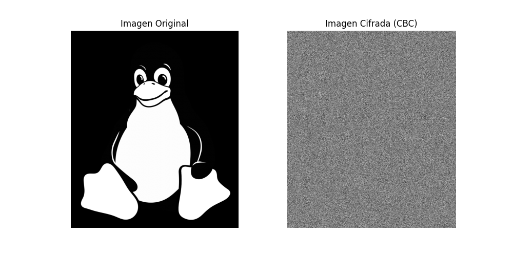

# 🔐 Laboratorio 3 - Cifrados Simetricos

## Parte No. 1

### Imagen cifrada con AES en modo ECB
```python
img = Image.open(image_path).convert('L')
image_data = np.array(img)
image_bytes = image_data.tobytes()

# Clave AES de 16 bytes
key = os.urandom(16)

# Longitud de los datos de la imagen sea múltiplo de 16
image_bytes_padded = pad(image_bytes, AES.block_size)

# Cifrado AES en modo ECB
cipher = AES.new(key, AES.MODE_ECB)
ciphertext = cipher.encrypt(image_bytes_padded)

cipher_image_data = np.frombuffer(ciphertext, dtype=np.uint8)
new_height = (img.height // 16) * 16
new_width = (img.width // 16) * 16
cipher_image_data = cipher_image_data[:new_height * new_width]
cipher_img = Image.fromarray(cipher_image_data.reshape((new_height, new_width)))
```



### Imagen cifrada con AES en modo CBC
```python
img = Image.open(image_path).convert('L')
image_data = np.array(img)
image_bytes = image_data.tobytes()

# Clave AES de 16 bytes
key = os.urandom(16)

# IV aleatorio para CBC
iv = get_random_bytes(AES.block_size)

# Longitud de los datos de la imagen sea múltiplo de 16
image_bytes_padded = pad(image_bytes, AES.block_size)

# Cifrar con AES en modo CBC
cipher_cbc = AES.new(key, AES.MODE_CBC, iv)
ciphertext_cbc = cipher_cbc.encrypt(image_bytes_padded)

cipher_image_data_cbc = np.frombuffer(ciphertext_cbc, dtype=np.uint8)
new_height = (img.height // 16) * 16
new_width = (img.width // 16) * 16
cipher_image_data_cbc = cipher_image_data_cbc[:new_height * new_width]
cipher_img_cbc = Image.fromarray(cipher_image_data_cbc.reshape((new_height, new_width)))
```



### Preguntas
- ¿Por qué el cifrado ECB revela los patrones de la imagen?
  - Porque ECB cifra cada bloque de 16 bytes de forma independiente usando la misma clave. Esto significa que si hay píxeles repetidos en la imagen, su cifrado también será idéntico. La imagen cifrada en ECB mantiene la estructura original, pero con píxeles alterados

- ¿Cómo cambia la apariencia con CBC?
  - En el modo CBC, cada bloque de datos se combina con el bloque anterior antes de ser cifrado, lo que provoca una dependencia entre ellos. Además, el primer bloque usa un vector de inicialización aleatorio, lo que rompe la repetición de patrones en la imagen cifrada.

- ¿Qué tan seguro es usar ECB para cifrar datos estructurados?
  - ECB es inseguro para datos estructurados como imágenes, documentos o bases de datos porque no oculta patrones repetidos.
