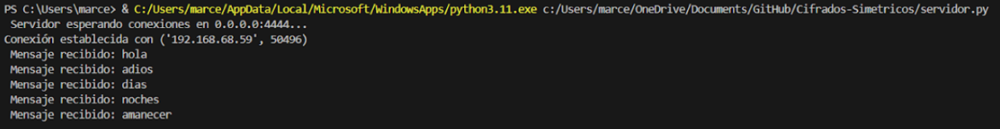
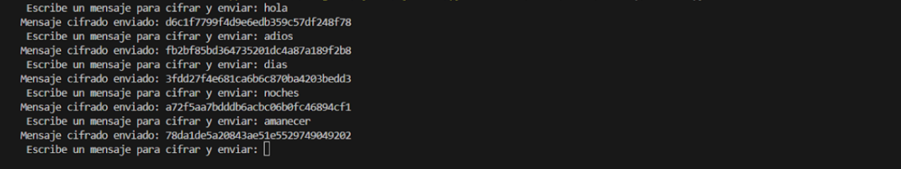
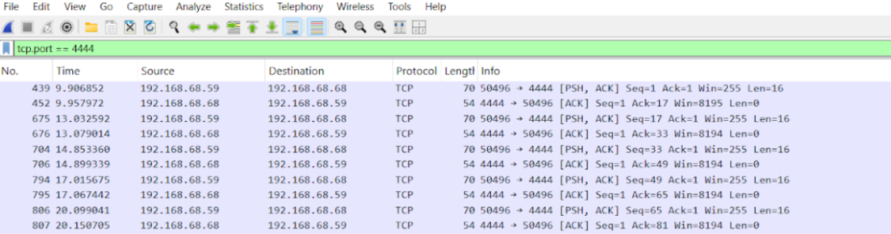

# 🔐 Laboratorio 3 - Cifrados Simetricos

## Parte No. 2

### Servidor
```python
servidor = socket.socket(socket.AF_INET, socket.SOCK_STREAM)
servidor.bind((HOST, PUERTO))
servidor.listen(1)

conn, addr = servidor.accept()

while True:
    datos_cifrados = conn.recv(1024)
    if not datos_cifrados:
        break

    cipher = AES.new(clave, AES.MODE_CBC, iv)
    mensaje_descifrado = unpad(cipher.decrypt(datos_cifrados), AES.block_size)

conn.close()
servidor.close()
```



### Cliente
```python
cliente = socket.socket(socket.AF_INET, socket.SOCK_STREAM)
cliente.connect((HOST, PUERTO))

while True:
    mensaje = input("Escribe un mensaje para cifrar y enviar: ")
    if mensaje.lower() == "salir":
        break

    cipher = AES.new(clave, AES.MODE_CBC, iv)
    mensaje_cifrado = cipher.encrypt(pad(mensaje.encode(), AES.block_size))
    
    cliente.send(mensaje_cifrado)

cliente.close()
```



### Wireshark


### Preguntas
- ¿Se puede identificar que los mensajes están cifrados con AES-CBC?
  - Sí, al analizar los paquetes capturados con Wireshark, se pueden identificar ciertas características que indican el uso de AES-CBC.

- ¿Cómo podríamos proteger más esta comunicación?
  - Usar TLS: En lugar de enviar los datos cifrados directamente por TCP, se debe encapsular en TLS, que protege contra ataques de análisis de tráfico y MITM.
  - Agregar autenticación: Un HMAC garantiza la integridad de los mensajes cifrados y evita ataques de modificación de paquetes.
  - Rotar claves e IVs: Asegurar que cada sesión o mensaje use una clave y un IV diferentes para evitar patrones predecibles en los datos cifrados.
