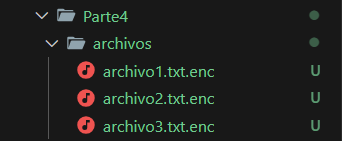
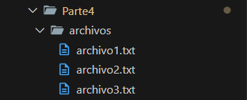

# 🔐 Laboratorio 3 - Cifrados Simetricos

## Parte No. 4

### Cifrado de archivos con AES

### Descifrado de archivos con AES

### Preguntas
- ¿Cómo podríamos evitar ataques de ransomware?
  - Realizar backups de archivos críticos en un almacenamiento offline.
  - No abrir archivos sospechosos de correos electrónicos.
  - Mantener el software actualizado para evitar vulnerabilidades.
  - Usar software antivirus y firewalls para bloquear amenazas.
  - Habilitar el control de acceso a archivos y restringir permisos.

- ¿Qué tan importante es almacenar claves de manera segura?
  - Si la clave se almacena de manera insegura, cualquier atacante puede descifrar los archivos.
  - En un ransomware real, los atacantes no almacenan la clave localmente, sino en un servidor remoto y la ocultan hasta que la víctima paga.
  - En un sistema seguro, las claves deben estar en un hardware seguro o protegidas con autenticación fuerte.
